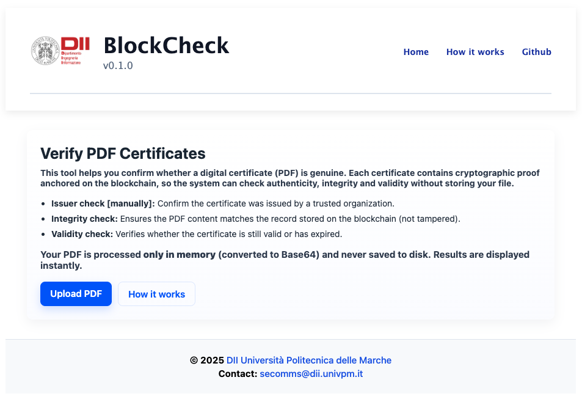
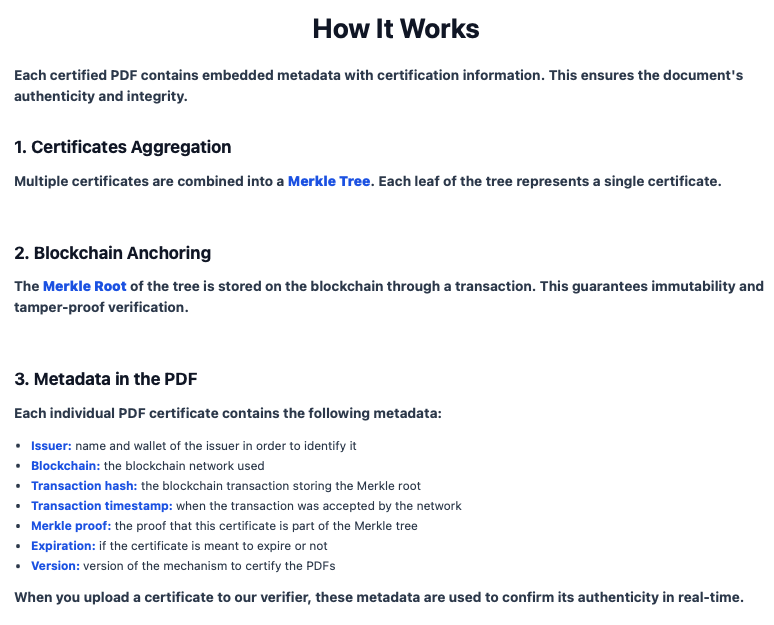
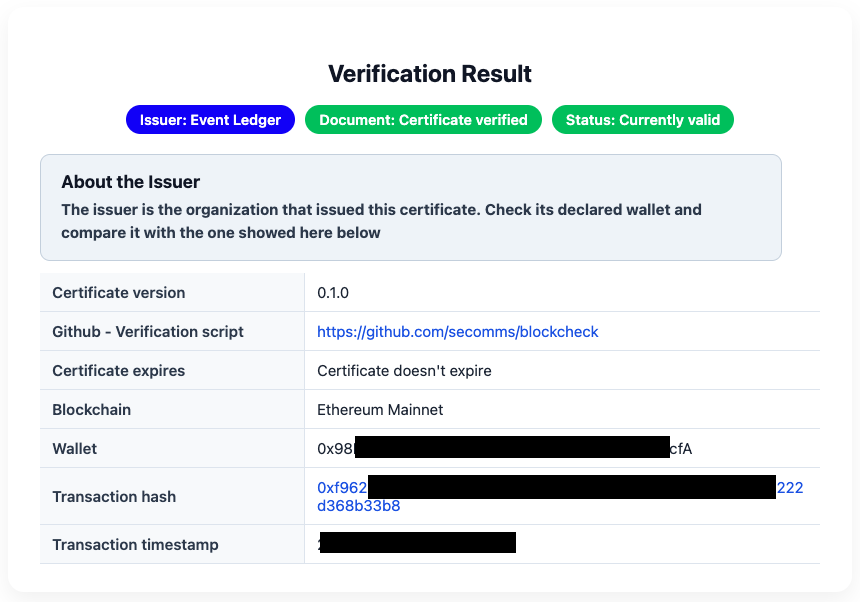

# BlockCheck v0.1.0

A simple web app to verify PDF certificates using embedded metadata and blockchain verification.

## Features
- Upload a PDF certificate directly in the browser (no file saved on server). 
- Parse PDF metadata containing blockchain, transaction hash, and Merkle proof. 
- Verify certificate authenticity and integrity in real-time. 
- Display verification results in a clean, responsive interface. 
- Frontend and backend integrated in a single Express + EJS app.

## Screenshots

### Homepage
“Upload Your PDF Certificate”
Shows the main page where users can upload a PDF for verification.


### How It Works
“How It Works: Blockchain & Merkle Proof”
Explains the process of PDF certification and verification using Merkle trees and blockchain.


### Verification Result
“Certificate Verification Result”
Displays the issuer, document status, blockchain info, and transaction hash.



## Prerequisites
- Node.js v20.16.0 
- npm 10.8.1

## Installation

1. Clone the repository:
```bash 
git clone https://github.com/secomms/blockcheck.git
cd v0.1.0

```

2. Install dependencies:
```bash
npm install
```

## Running the App
Start the server:
```bash
npm start
```
By default, the app runs on http://localhost:3000.


## Usage
1. Open the app in your browser. 
2. Upload a PDF certificate using the homepage form. 
3. Wait for verification results:
   - Issuer
   - Document validity
   - Expiration 
   - Blockchain info, transaction hash, etc.

## Notes
- PDFs are processed in memory only; nothing is stored on the server. 
- The app currently supports Ethereum Mainnet for blockchain verification.